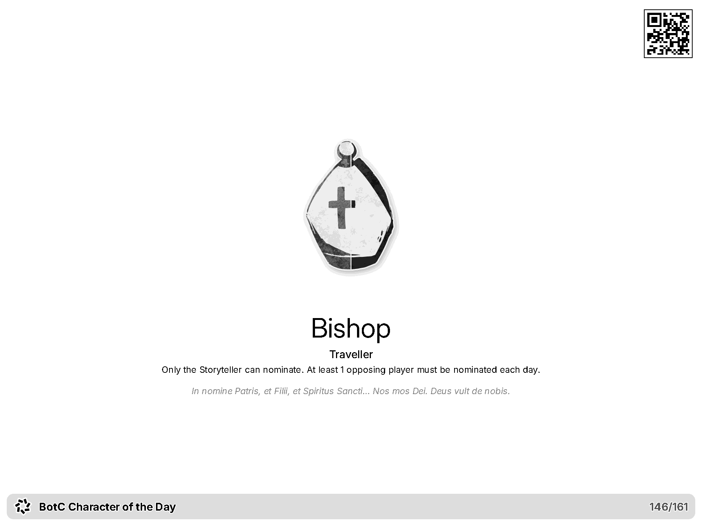

# TRMNL Blood on the Clocktower's Character of the Day (TRMNLBotCCotD)

A [TRMNL](https://trmnl.com/) private plugin that shows **one Blood on the Clocktower character per day** on your e-ink display.

<picture>
  <source media="(prefers-color-scheme: dark)" srcset="docs/demo-dark.png">
  <source media="(prefers-color-scheme: light)" srcset="docs/demo-light.png">
  
</picture>

Each day you get the character token, name, type, ability, flavor text, and optionally a QR code to the [official wiki](https://wiki.bloodontheclocktower.com/) (toggle **Wiki QR code** in plugin settings).

## How the rotation works

- Set a **start date** — that begins **cycle 0**.
- Optional **shuffle seed** — salt for per-cycle order (change it to reshuffle without moving the start date).
- Optional **wiki QR code** — corner link to the character’s wiki page (disable in plugin settings for a cleaner layout).
- Each **cycle** shows every character that was available when that cycle started, **one per day**, in a **deterministic shuffle** unique to that cycle.
- The **last character of a cycle never appears again on the first day of the next cycle** (no back-to-back repeats at boundaries).
- **New characters** only join at the **next** cycle (mid-cycle is never disrupted).
- To restart from scratch, set a new start date in plugin settings.

Example: cycle 0 has 5 characters (5 days). A 6th character is added on day 3 — days 0–4 stay the same; cycle 1 (day 5+) uses all 6 with a new shuffle order.

Title bar: `BotC Character of the Day · 14/161` (day within cycle, cycle length).

## Setup

1. Create a **Private Plugin** on TRMNL (or clone this repo and use `trmnlp`).
2. Copy or push all `src/` files:

   | TRMNL tab | File |
   |-----------|------|
   | Shared | `src/shared.liquid` |
   | Serverless (Python) | `src/transform.py` |
   | Full / Half H / Half V / Quadrant | matching `src/*.liquid` |
   | Settings | `src/settings.yml` |

3. Enable **Serverless Python** and paste or push `src/transform.py`. On TRMNL’s servers only that file runs; it loads `data/characters_manifest.json` from GitHub if the file is not on disk.
4. Set **Rotation start date** (`YYYY-MM-DD`) and save.

`refresh_interval` is 1440 minutes (once per day). Dark mode is enabled in settings.

## Local preview

Requires [Docker](https://www.docker.com/) or Ruby 4+ with `gem install trmnl_preview`.

```sh
make serve
# http://localhost:4567/full
# http://localhost:4567/full?dark_mode=true
```

Or `docker compose up`, or `./bin/trmnlp serve` directly.

Default preview start date is in [`.trmnlp.yml`](.trmnlp.yml) under `custom_fields.start_date` (passed to the transform as `trmnl.plugin_settings.custom_fields_values`).

If Docker preview still shows “Set a start date”, restart `docker compose up` after saving `.trmnlp.yml`.

## Updating the character list

Character data lives in [`data/characters_manifest.json`](data/characters_manifest.json) (not under `src/`). Sync scripts write there; serverless fetches the same file from GitHub when it is not on disk.

**Sources:** name, type, ability, and flavor come from the latest [botc-release `roles.json`](https://github.com/ThePandemoniumInstitute/botc-release/blob/main/resources/data/roles.json) on `main`. The wiki supplies token images and `first_available` (Revealed/When from the page, else the wiki page creation date).

When roles or wiki pages change:

```sh
make sync
# or: python3 scripts/sync_characters.py
```

Validate locally without Docker:

```sh
python3 scripts/validate_plugin.py
```

Run rotation tests (requires [uv](https://docs.astral.sh/uv/)):

```sh
uv sync   # first time
make test
```

Debug rotation (current cycle, upcoming days, arbitrary cycle index):

```sh
python3 scripts/debug_rotation.py --start 2026-05-01 today
python3 scripts/debug_rotation.py --start 2026-05-01 current-cycle
python3 scripts/debug_rotation.py --start 2026-05-01 next 30
python3 scripts/debug_rotation.py --start 2026-05-01 cycle 2
python3 scripts/debug_rotation.py --start 2026-05-01 cycles 0-3
python3 scripts/debug_rotation.py --start 2026-05-01 range 2026-06-01 2026-06-15
```

Then push:

```sh
make login
make push
```

**Sync behavior:** roster follows `roles.json`. `first_available` is set from the wiki Revealed/When field when present, otherwise from when the wiki page was created, otherwise the previous manifest value, otherwise today. Characters appear only in cycles that start on or after that date.

## Deploy

```sh
gem install trmnl_preview
make login
make push
```

After the first push, add the plugin `id` from TRMNL to `src/settings.yml` for future updates.

## License

[MIT](LICENSE)
